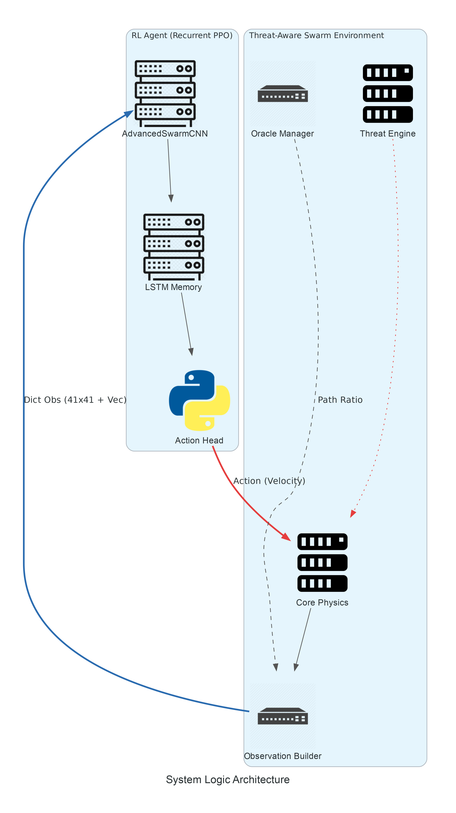
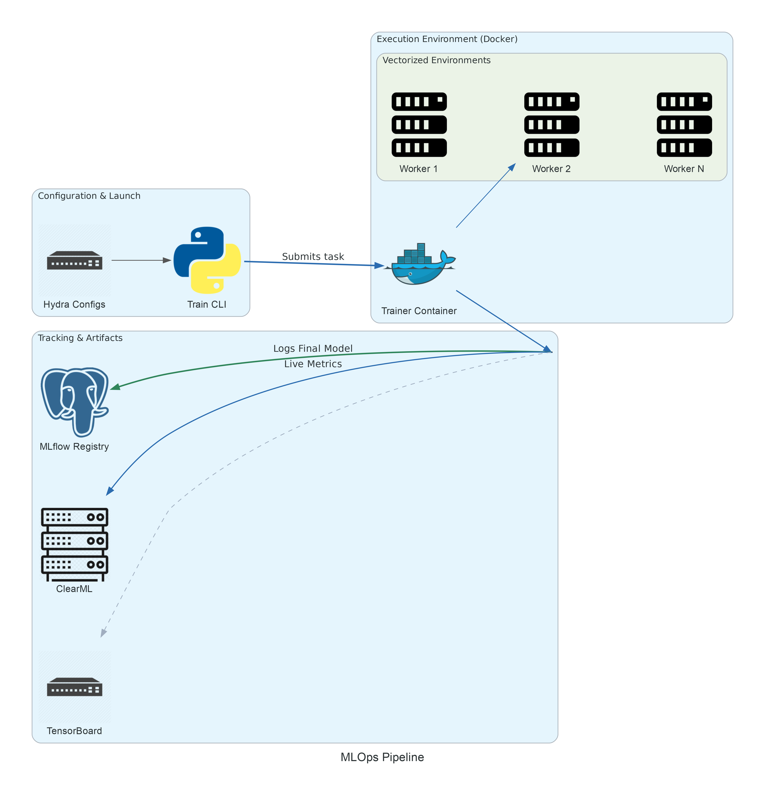

# Threat-Aware Swarm

`Threat-Aware Swarm` — исследовательский pet-проект про мультиагентную навигацию в 2D-среде с частичной наблюдаемостью, динамическими угрозами и непрерывным управлением.

Это не просто обученный PPO-агент. Репозиторий собран как полноценная экспериментальная система:
- собственная среда на PettingZoo с force-based физикой;
- сильные baseline-планировщики (`A*`, `MPC-lite`, `Potential Fields`, `Flow Field`);
- стек PPO / RecurrentPPO (`AdvancedSwarmCNN` + LSTM);
- React UI в стиле Mission Control;
- формализованный benchmark, reproducibility guardrails, tuning и release-отчёты.

## За минуту

### Какую задачу решает проект
Группа агентов должна дойти до цели в общем 2D-мире, где одновременно есть:
- локальные ограниченные наблюдения;
- динамические угрозы и статические препятствия;
- drag, wind, инерция и ограничения по ускорению;
- конфликт между безопасностью, скоростью и длиной пути.

### Что здесь реализовано
- swarm-среда на `PettingZoo ParallelEnv`;
- `Dict-obs only` контракт `obs@1694:v5`;
- единый control-loop через `waypoint` и общий low-level controller;
- baseline'ы уровня planning/control, а не только простые эвристики;
- PPO / RecurrentPPO для честного сравнения с классическими методами;
- UI для визуализации, отладки и демо;
- инфраструктура для train/eval/tuning/reporting.

### Почему проект сильнее типичного RL pet-проекта
- PPO сравнивается не с игрушечными baseline'ами, а с реальными планировщиками.
- Benchmark policy формально разделяет `fair`, `privileged` и `oracle-only` режимы.
- UI, perf-профили и release bundle являются частью инженерной системы, а не довеском.
- В проекте есть не только обучение, но и воспроизводимый evaluation/tuning контур.

## Что именно здесь интересно

### Исследовательская часть
- Навигация в среде с угрозами и частичной наблюдаемостью.
- Сравнение learned policy с planner-heavy baseline'ами.
- Разделение честного benchmark и privileged reference-путей.
- Отдельные OOD и robustness-пайплайны.

### Инженерная часть
- Hydra как единая точка входа для train/eval/tuning.
- MLflow как основной tracker и хранилище артефактов.
- React-only UI runtime с `telemetry@v2`.
- Release-friendly benchmark pipeline, metric manifests, config audit.
- Fixed-step perf protocol для baseline/env regression-check.

## Витрина для ревьюера

Если нужно быстро понять, что сделано, открывай в таком порядке:
1. `docs/showcase.md`
2. `docs/benchmark_policy.md`
3. `docs/ROADMAP.md`
4. `AGENTS.md`
5. UI через `docker compose up web`

## Системный обзор

### Архитектура runtime


### Поток экспериментов и артефактов


## Основные подсистемы

| Подсистема | Что есть сейчас |
| --- | --- |
| Среда | PettingZoo ParallelEnv, Physics 2.0, wind, drag, battery, SDF-стены, dynamic threats |
| Наблюдение | только `Dict`-контракт `obs@1694:v5`, локальная сетка `41x41` |
| Управление | `Perception -> Planner -> Controller`, единый `waypoint`-режим |
| Бейзлайны | `A*`, `MPC-lite`, `Potential Fields`, `Flow Field`, Oracle reference |
| RL | `AdvancedSwarmCNN` + `RecurrentPPO` |
| UI | React Mission Control, compare/demo/research, timeline, charts, scene editor, GIF export |
| Benchmark | `fair / privileged / oracle-only`, OOD pack, leakage guardrails, metric semantics |
| Tuning | split protocol, holdout/OOD validation, eval cache, profiles `fast|balanced|deep` |

## Сильные стороны проекта

### 1. Сильный baseline-слой
Здесь есть полноценные planning baseline'ы. Это делает сравнение с PPO содержательным, а не декоративным.

### 2. Честный benchmark формализован
Репозиторий явно разводит:
- `fair` методы;
- `privileged` map-aware references;
- `oracle-only` сущности для нормировки метрик.

### 3. UI — часть системы
Веб-интерфейс нужен не только для картинки. Он используется для:
- compare mode;
- визуализации телеметрии и timeline;
- scene editing;
- attention overlays;
- GIF export;
- демонстрации baseline/RL-поведения.

### 4. Среда богаче обычного gridworld
Агент действует не в примитивной дискретной карте, а через общий low-level controller под физическими ограничениями и риском.

### 5. Репозиторий операционен
Есть воспроизводимый путь для:
- обучения;
- benchmark/eval;
- OOD-проверок;
- tuning;
- построения release-отчётов.

## Быстрый старт

### 1. Собрать runtime
```bash
make warm
```

### 2. Поднять UI и MLflow
```bash
docker compose up -d web mlflow
```

Открыть:
- UI: `http://localhost:8000`
- MLflow: `http://localhost:5000`

### 3. Прогнать быстрый baseline-eval
```bash
docker compose run --rm trainer python -m scripts.eval.eval_scenarios \
  policy=baseline:potential_fields \
  scenes=[preset:sanity] \
  episodes=2
```

### 4. Запустить обучение PPO
```bash
docker compose run --rm trainer python -m scripts.train.trained_ppo \
  experiment=ppo_waypoint
```

### 5. Прогнать sanity-пакет
```bash
make sanity-pack
```

## Типовые сценарии работы

### UI / интерактивное демо
```bash
docker compose up web
```

Если менялся `ui_frontend/`:
```bash
make ui-build
```

### Benchmark по baseline'ам
```bash
docker compose run --rm trainer python -m scripts.bench.benchmark_baselines \
  policy=all \
  n_episodes=5
```

### Полный evaluation bundle
```bash
make full-eval
```

Этот таргет запускает:
- fair benchmark;
- privileged benchmark;
- OOD evaluation;
- demo-pack;
- compare/demo/story reports.

### Release bundle для benchmark-результатов
```bash
make benchmark-release \
  RELEASE_INPUTS="runs/bench/<fair_run> runs/bench/<dynamic_run>" \
  RELEASE_LABELS="fair-static fair-dynamic"
```

На выходе:
- `benchmark_release.json`
- `benchmark_release.md`
- `leaderboard.csv`

### Запуск experiment spec
```bash
make experiment EXPERIMENT_SPEC=configs/experiments/smoke.yaml
```

### Demo-артефакты
```bash
make demo-pack
make demo-report
make demo-story
```

### Тюнинг baseline'ов
```bash
# дешёвый search-профиль
make tune-fast TUNE_OVERRIDES="policy=[all] scenes=[preset:static] tuning/step_budget=static"

# основной тюнинг с holdout-проверкой
make tune-balanced TUNE_OVERRIDES="policy=[all] method=optuna trials=80 n_jobs=4 pruner=asha scenes=[preset:static] tuning/step_budget=static stage_b=true topk=5"
```

Для длинных семейств сцен используй step-budget пресеты:
- `tuning/step_budget=static` → `900` шагов;
- `tuning/step_budget=dynamic` → `1000` шагов;
- `tuning/step_budget=long` → `1600` шагов.

Важно:
- для `method=optuna n_jobs>1` тюнер использует безопасный process-backend:
  главный процесс держит study/storage, а trial evaluation идёт в `spawn` worker'ах;
- debug-only thread path оставлен только для controlled repro через `parallel_debug`.

Тяжёлый `stage_b` smoke вынесен из обычного `pytest` и запускается отдельно:
```bash
make test-tuning-stageb
```

### Fixed-step профилирование производительности
```bash
make profile-baselines
make perf-gate
```

## Политика benchmark

Проект использует три класса методов:

| Категория | Смысл |
| --- | --- |
| `fair` | метод видит только информацию, реально доступную агенту |
| `privileged` | метод получает полную карту или другой дополнительный сигнал |
| `oracle-only` | эталон для нормировки и интерпретации, а не участник основного leaderboard |

Это важно, потому что проект задуман как честный benchmark, а не как витрина с несопоставимыми методами.

См.:
- `docs/benchmark_policy.md`
- `docs/benchmarks/leaderboards.md`
- `docs/benchmarks/metric_semantics.md`

## Структура репозитория

```text
baselines/      baseline-политики, planner'ы и контроллеры
common/         общие контракты, visibility-правила и physics helper'ы
env/            среда, physics, observer, oracle, reward, scene runtime
configs/        Hydra-конфиги, experiment specs, benchmark/tuning policy
scripts/        train / eval / tuning / analysis / perf / debug entrypoints
scenarios/      статические, динамические, OOD и пользовательские сцены
ui/             FastAPI backend для web UI
ui_frontend/    React frontend
models/         сетевые модули и метаданные моделей
runs/           локальные runtime-артефакты (рабочий буфер)
docs/           benchmark, infra, reference, logs, perf, showcase
tests/          unit / integration / invariant tests
```

## Карта документации

### Начать отсюда
- `docs/README.md` — индекс документации
- `docs/showcase.md` — короткая презентационная страница
- `docs/ROADMAP.md` — текущее состояние и завершённые workstream'ы
- `AGENTS.md` — краткая runtime-память для разработчика/агента

### Benchmark и оценка
- `docs/benchmark_policy.md`
- `docs/benchmarks/leaderboards.md`
- `docs/benchmarks/metric_semantics.md`

### Runtime и инфраструктура
- `docs/infra/docker.md`
- `docs/infra/hydra.md`
- `docs/infra/mlflow.md`
- `docs/infra/ui.md`

### Справка
- `docs/reference/env_schema.md`
- `docs/reference/agent_playbook.md`
- `docs/reference/diagnostics.md`
- `docs/reference/model_storage.md`
- `docs/reference/tech_debt.md`

### Журналы
- `docs/logs/training_log.md`
- `docs/logs/research_log.md`

## Текущие runtime-дефолты

| Тема | Значение |
| --- | --- |
| Наблюдение | `obs@1694:v5` |
| Управление | `waypoint` |
| PPO-стек | `AdvancedSwarmCNN` + `RecurrentPPO` |
| UI | только React runtime |
| Tracking | MLflow включён по умолчанию |
| Tuning profile | `balanced` |
| Benchmark policy | по умолчанию fair, oracle скрыт |

## Что стоит посмотреть в первую очередь

Если задача — быстро оценить инженерный уровень проекта:
1. пролистать этот `README.md`;
2. открыть `docs/benchmark_policy.md`;
3. открыть `docs/ROADMAP.md`;
4. поднять UI через `docker compose up web`;
5. прогнать `make sanity-pack` или один baseline benchmark.

Этого достаточно, чтобы увидеть и исследовательскую, и инженерную сторону репозитория.

## Лицензия

MIT, если в конкретной подпапке не указано иное.
